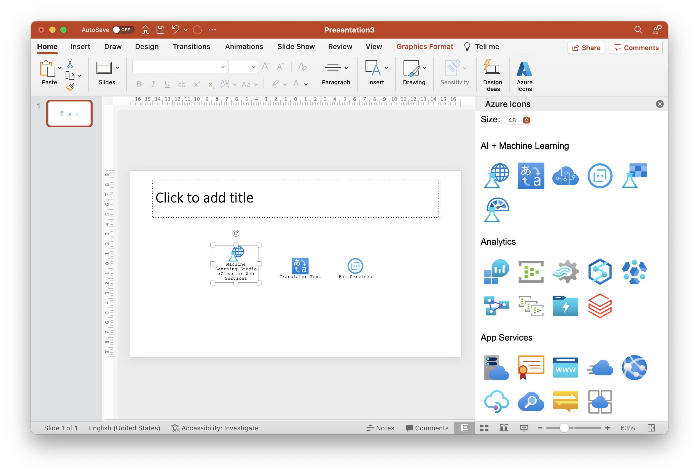

# ppt-azure-icons
Powerpoint add-in with a gallery of the official Azure Icons

## Project installation
For working with this project, it is needed
- Visual Studio Code
- Typescript
- Node JS
- npm

The project is cross-platform, can be built and debugged along with Office 365 in Windows and macOS

## Build process
For installing the npm packages, open a terminal and type `npm install`

It will also require to manually run the prebuild script: `node prebuild.js`. That will create the file `taskpane.html`

After building for the first time and executing the default task, open a terminal and type `npm start`. That will launch PowerPoint showing the add-in icon.

## Icon source
The icons were downloaded from the official Microsoft page: https://docs.microsoft.com/en-us/azure/architecture/icons/ 

The current update date is January 2021 (version 4), and the icons will be updated as new releases arrive.

## How to install the add-in